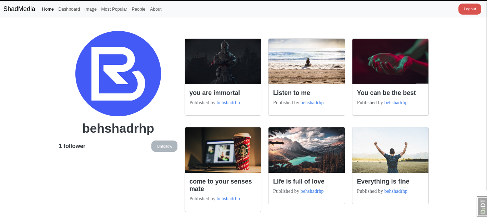

# ShadMedia - A Social Media Platform built with Django

ShadMedia is a modern social media platform developed using Django, a high-level Python web framework that follows the Model-View-Template (MVT) architectural pattern. It is designed with responsiveness in mind, powered by Bootstrap 5, and offers a range of features for users to connect and share content.





## Key Features

- **User Authentication**: Secure user registration and login with email and username.

- **Bookmark Sharing**: Seamlessly share bookmarks with friends and followers.

- **Password Recovery**: Forgot your password? Easily recover it via email.

- **Email Verification**: Ensure account security with email verification.

- **Follow and Unfollow**: Stay connected by following or unfollowing other users.

- **Like Posts**: Express appreciation for posts through likes.

- **Ranking System**: Posts are ranked for better visibility and engagement.

- **View Count**: Keep track of post views.

## User Activity Tracking

ShadMedia includes a comprehensive user activity tracking system that allows you to monitor and analyze user interactions on the platform. This system provides valuable insights into user behavior and engagement. Some of the features of the user activity tracking system include:

- **User Engagement Metrics**: Track user interactions such as likes, comments, and shares.

- **Post Performance Analytics**: Monitor the performance of posts, including view counts and rankings.

- **Follower and Following Activity**: Analyze how users are following and engaging with each other.

- **Custom Reports**: Create custom reports and dashboards to gain deeper insights into user activity.

- **Security and Privacy**: Ensure that user data is handled securely and in compliance with privacy regulations.

With our user activity tracking system, you can make data-driven decisions to enhance the user experience and improve your platform's functionality.

## Getting Insights

To access user activity data and analytics, follow these steps:

1. Access the admin panel by visiting `http://your-website.com/admin`.
2. Log in with your superuser credentials.
3. Navigate to the user activity tracking section to view reports and analytics.

## Privacy and Data Protection

We take user data privacy seriously. The user activity tracking system complies with data protection regulations and ensures that user data is handled securely and responsibly.

If you have any questions or concerns about user activity tracking and data privacy, please contact us at [privacy@shadmedia.com](mailto:privacy@shadmedia.com).

## Getting Started

To start using ShadMedia locally or deploy it, follow these steps:

1. Clone the repository: `git clone https://github.com/behshadrhp/shadmedia.git`
2. Install the required dependencies: `pip install -r requirements.txt`
3. Configure your database and update environment variables.
4. Run migrations: `python manage.py migrate`
5. Create a superuser: `python manage.py createsuperuser`
6. Start the development server: `python manage.py runserver`

### Dockerized Development Environment

To simplify development, ShadMedia offers a Docker Compose configuration for database, web, Nginx, and more:

```yaml
version: "3.9"

services:
  postgres_db:
    # ... (existing configuration)
    
  pgadmin:
    # ... (existing configuration)

  dj_backend:
    # ... (existing configuration)

  nginx:
    # ... (existing configuration)

  redis:
    # ... (existing configuration)
    
volumes:
  postgres_data:
```

Remember to customize the local environment variables and settings as needed for your development environment. Docker Compose allows you to manage your development environment effortlessly.

## Technologies Used

- Django: A Python web framework that follows the MVT architectural pattern.
- Bootstrap 5: For a responsive and modern user interface.
- [List other technologies/libraries used]

## Contributing

We welcome contributions from the community. If you'd like to contribute to ShadMedia, please follow our [contribution guidelines](CONTRIBUTING.md).

## License

This project is licensed under the MIT License. See the [LICENSE](LICENSE) file for details.

## Copyright

&copy; 2023 ShadMedia | All rights reserved.

This GitHub repository and its contents are the intellectual property of the ShadMedia account owner. Any unauthorized use, reproduction, or distribution of the code and assets within this repository is strictly prohibited.

For inquiries and licensing information, please contact [behshad.rahmanpour@email.com](mailto:behshad.rahmanpour@email.com).
